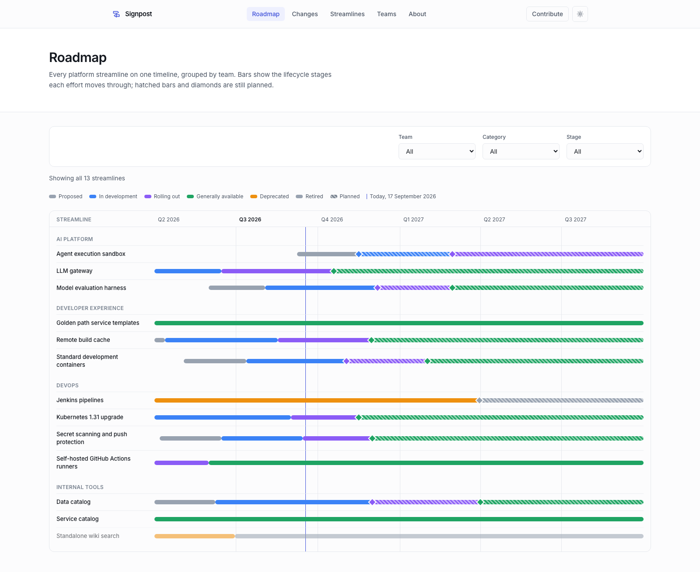
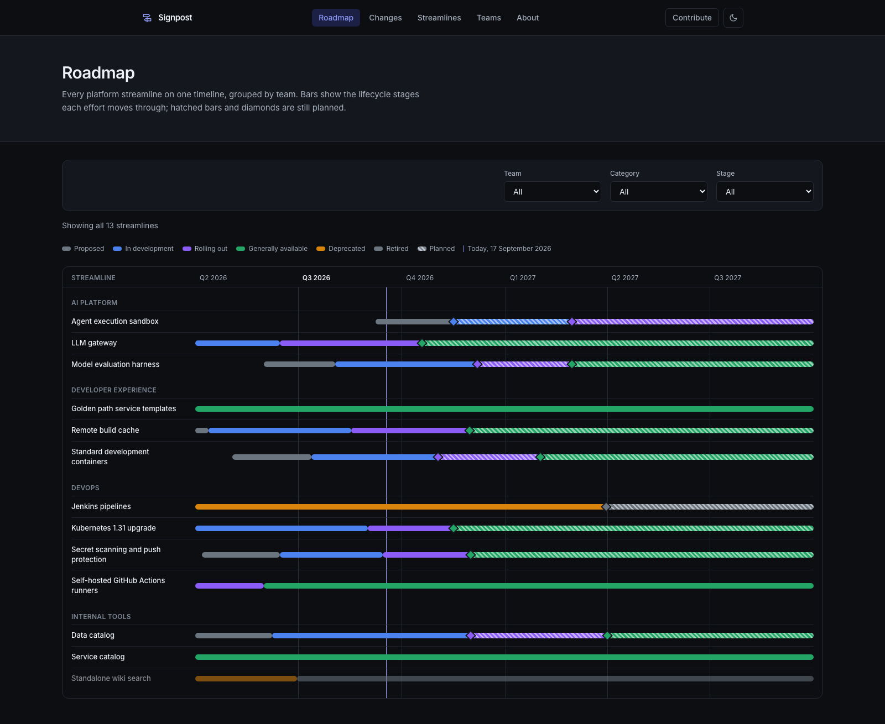
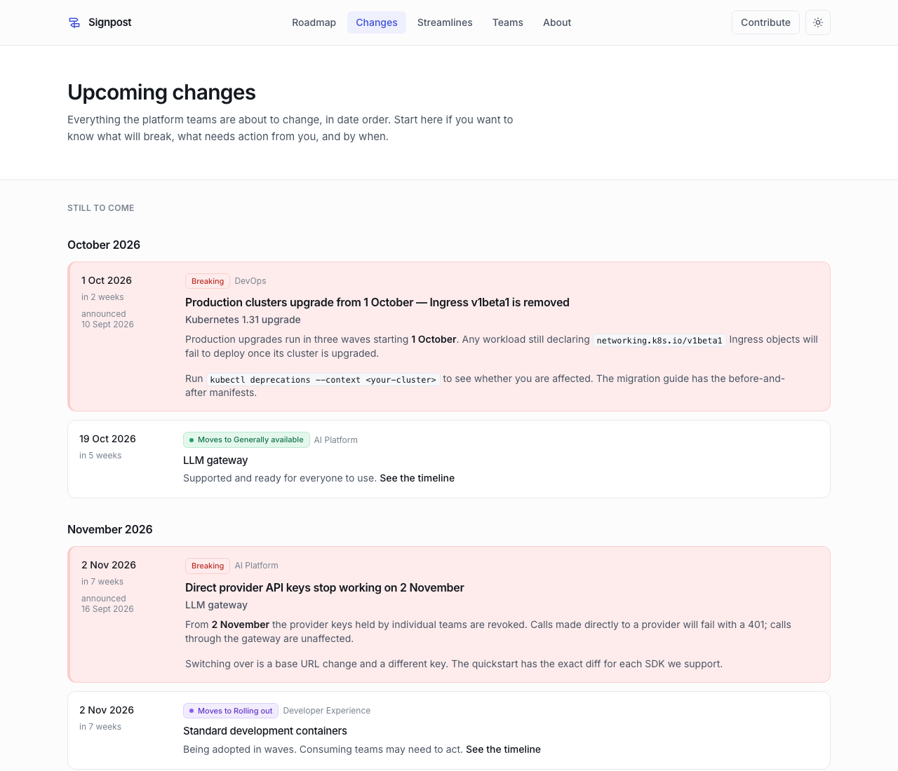
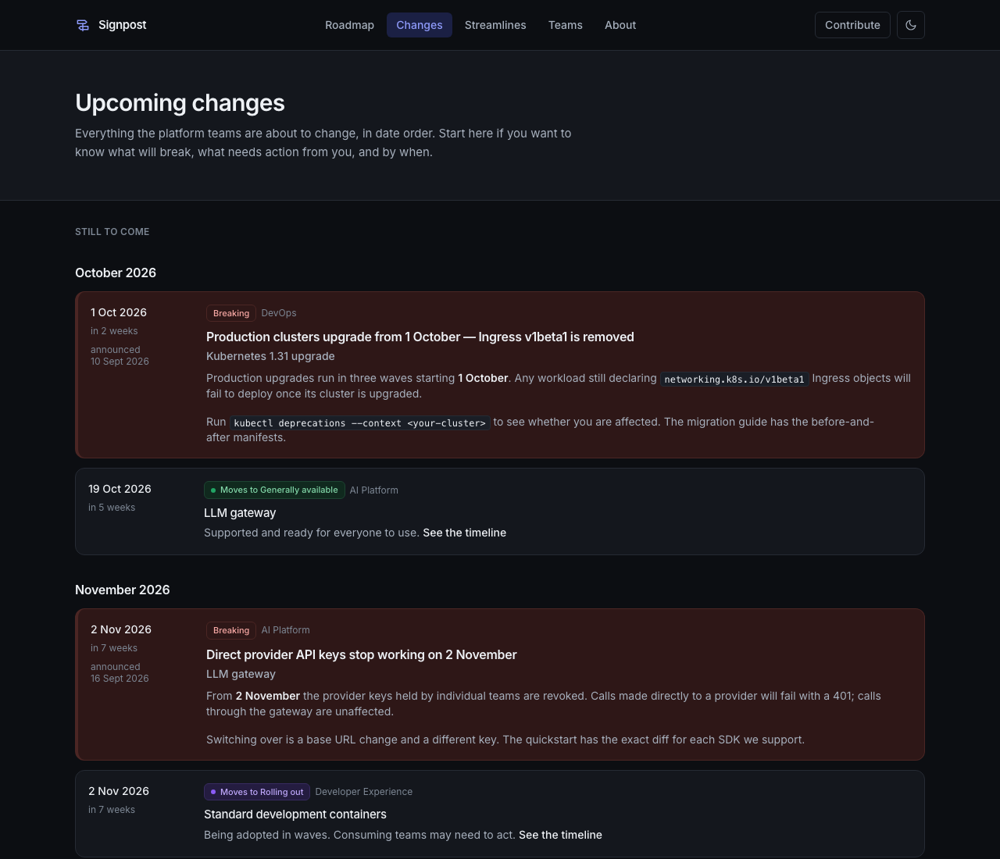
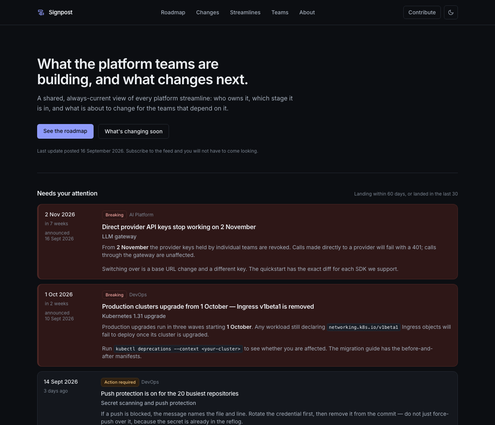

# Signpost

**A static site that answers "what is the platform team doing, and what is about to change?"** — built from YAML files in a Git repository, deployed to GitHub Pages, with no database and no server.

[](LICENSE)

Platform teams ship things that land on everyone else: a cluster upgrade, a CI migration, a deprecated gateway. The work is usually visible *somewhere* — a wiki page, a Slack thread, a Jira epic nobody outside the team can read — and the result is the same either way. Other teams find out when something breaks.

Signpost gives every team one file per effort. They edit it when the plan changes, open a pull request, and the site rebuilds. Anyone can see which stage each effort is in, when it lands, and who owns it — and subscribe to a feed so they do not have to check.

---

## What it looks like

**[See it running →](https://anonycoders.github.io/signpost-sample/)** — a populated instance with four invented platform teams and thirteen streamlines, published from [`Anonycoders/signpost-sample`](https://github.com/Anonycoders/signpost-sample). This repository is the template that sample was made from, and it ships empty; the screenshots below are of the sample.

**Roadmap** — every effort as a lane across six quarters, filterable by team, stage and category.

| Light | Dark |
| --- | --- |
|  |  |

**Changes** — a reverse-chronological log of what teams have announced, with breaking changes marked and dated.

| Light | Dark |
| --- | --- |
|  |  |

**Home** — what landed recently and what lands soon, above everything else.



Plus a filterable catalog of every streamline, a page per team, a page per streamline with its full timeline and update history, and an `/about/` page explaining the whole thing to a first-time visitor.

**[docs/using.md](docs/using.md)** is the guide for the people who only ever read the site: what a hatched bar with a diamond on it means, which window the attention strip covers, and how to point a feed reader or a Slack channel at one team's work.

---

## Quickstart

```bash
git clone https://github.com/Anonycoders/signpost.git
cd signpost
nvm use          # Node 26, per .nvmrc — the repo sets engine-strict
npm install
npm run dev      # http://localhost:4321
```

`content/` ships empty, so that is an empty site — every page renders, and every page tells you what to add. Filling it is [docs/adopting.md](docs/adopting.md); the [sample](https://anonycoders.github.io/signpost-sample/) is where it ends up.

Other scripts:

| Command | What it does |
| --- | --- |
| `npm run dev` | Dev server with hot reload |
| `npm run validate` | Content validator — the same one CI runs |
| `npm run check` | TypeScript and Astro diagnostics |
| `npm run test` | Unit tests |
| `npm run build` | Validate, then build the static site into `dist/` |
| `npm run preview` | Serve `dist/` as it will be deployed |

If `npm install` refuses to run, it is `engine-strict` doing its job: this needs Node 22.12 or newer, and `.nvmrc` pins the version the project is built against.

---

## Publishing your team's work

One YAML file per streamline, in `content/streamlines/<team>/<slug>.yaml`. It holds the structured part — stage, owners, timeline dates, links — and `updates:` is the running log of announcements, newest first:

```yaml
updates:
  - date: 2026-09-10       # when you posted it
    status: rolling-out
    effective: 2026-10-01  # when it actually lands on people
    impact: breaking
    title: Production clusters upgrade from 1 October — Ingress v1beta1 is removed
    body: |
      Production upgrades run in three waves starting **1 October**. Any workload
      still declaring `networking.k8s.io/v1beta1` Ingress objects will fail to
      deploy once its cluster is upgraded.
```

Edit, open a pull request, CODEOWNERS routes it to your team, CI validates it, merge deploys it. The validator blocks the mistakes that make a roadmap untrustworthy — a deprecation with no retirement date, a breaking change with no notice period, a timeline that runs backwards — and it explains what to fix rather than which schema rule failed.

**[CONTRIBUTING.md](CONTRIBUTING.md)** is the five-minute version: templates to copy, every field explained, and what CI will and will not let through.

---

## Running it for your own organization

Fork it, edit one config file, add your content. **[docs/adopting.md](docs/adopting.md)** walks through it: naming and branding, defining your own lifecycle stages and categories, wiring CODEOWNERS to your teams, deploying to GitHub Pages (including GitHub Enterprise), and what to do if your instance has Pages turned off.

Everything an organization needs to change lives in [`site.config.ts`](site.config.ts) — the stages, the categories, the impact levels, the colours, the attention windows. The rules follow the config: rename `deprecated` to `sunsetting` and the validator's messages, the filters and the roadmap legend all rename with it.

---

## How it works

**Git is the database.** There is no CMS, no admin login, no runtime. `content/` is the source of truth; the site is a pure function of it. Reviewing a roadmap change is reviewing a diff, and the history of what a team promised is `git log`.

**The build is the gatekeeper.** `scripts/content-rules.ts` holds the rules, shared between the CLI validator and the Astro build via one set of Zod schemas, so CI and your editor cannot disagree. Errors block the merge; softer things (a streamline nobody has updated in a long time) warn. The same schemas generate the JSON Schema in `schemas/`, so an editor offers the field names — and *your* stage names, not ours — while somebody is still typing.

**Feeds, so nobody has to remember to look.** A site-wide Atom feed at `/feed.xml` and one per team, hand-built to Atom 1.0 (RFC 4287) with stable entry IDs — so a feed reader, a Slack integration or a Teams connector can subscribe once and get every announcement.

**It comes to you, if you want it to.** An optional scheduled job posts what changed to Slack — stage dates moving, phase dates moving, new updates — routed per team or per streamline, so the people who depend on your work hear about a retirement date without visiting a roadmap. Off unless configured, and its first run is deliberately silent so turning it on never floods a channel. See [docs/adopting.md](docs/adopting.md#announcing-changes-in-slack).

**A nightly rebuild.** "Landing in 60 days" is only true on the day it is built, so the deploy workflow also runs on a schedule. The rationale is in [docs/adopting.md](docs/adopting.md#5-deploy-to-pages).

**It prints.** The roadmap and the changes log have print stylesheets, for the people who bring a roadmap to a planning meeting on paper. One known limitation: a roadmap that spans more than one printed page does not repeat the quarter headers on the second page.

### Layout

```
content/
  teams/<slug>.yaml               one file per team
  streamlines/<team>/<slug>.yaml  one file per effort
site.config.ts                    everything an organization changes
schemas/                          generated from site.config.ts, for editors
src/
  pages/                          routes
  lib/                            roadmap, changes, timeline, feeds — unit-tested
  components/                     Astro components
scripts/
  content-rules.ts                the validation rules
  validate-content.ts             the CLI wrapper CI runs
  json-schema.ts                  regenerates schemas/ from the Zod schemas
  announcements.ts                what is worth announcing — pure, no IO
  announce.ts                     the CLI that reads, posts and records
  changelog.ts                    reads CHANGELOG.md for the release notes
  release.ts                      cuts a version: dates it, opens a new one
  update.ts                       merges the template, upgrade notes first
CHANGELOG.md                      what changed, hand-written, per version
.github/
  workflows/ci.yml                validate + check + test on every PR
  workflows/deploy.yml            build + publish to Pages on main and nightly
  workflows/announce.yml          post what changed to Slack, if configured
  workflows/release.yml           publish a GitHub Release on a v* tag
  CODEOWNERS                      which team reviews which directory
```

Built with [Astro](https://astro.build) and [Tailwind CSS](https://tailwindcss.com). No client-side framework: the filters are under a hundred lines of vanilla JavaScript over server-rendered cards, and every page still renders its content without them.

---

## Contributing to Signpost itself

Bug reports, ideas and pull requests are welcome — see [CONTRIBUTING.md](CONTRIBUTING.md#changing-the-site-itself) and the [Code of Conduct](CODE_OF_CONDUCT.md). **[docs/developing.md](docs/developing.md)** is the tour of the code: the data flow file by file, where the two validation layers live, and what must never be hardcoded. If you have adopted this somewhere, we would genuinely like to hear what you had to change.

Updates are released as versions, and the version number is written for you: a new major means your fork has to do something after merging, anything else means merge and carry on. [CHANGELOG.md](CHANGELOG.md) says what changed and, for every entry, what it costs to take it — [docs/releasing.md](docs/releasing.md) has the rules behind both.

## License

MIT — see [LICENSE](LICENSE). Fork it, rebrand it, sell services around it. No attribution required, though a link back is appreciated.
